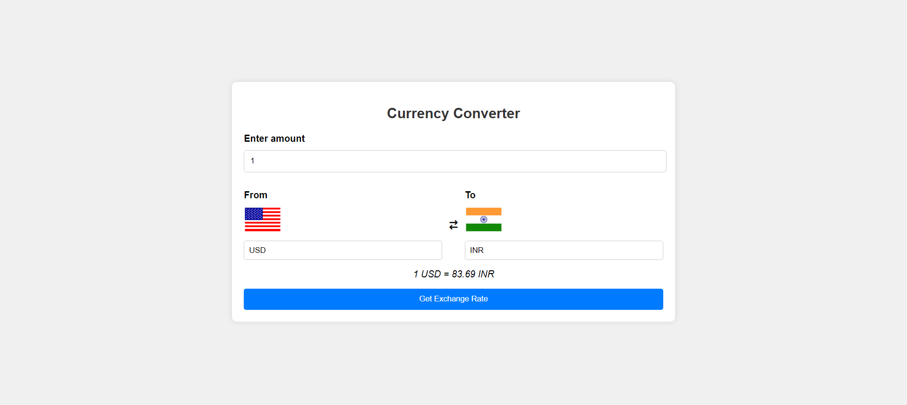

# Currency Converter

This application allows users to convert between different currencies with real-time exchange rates.

## Getting Started

1. Clone the repository and navigate to the project directory.
2. Visit [Exchange API](https://www.exchangerate-api.com/). Enter your email to receive a free API key.
3. Replace API-KEY in index.js with your API key in index.js : `const BASE_URL = "https://v6.exchangerate-api.com/v6/API_KEY/latest";`
4. Simply open index.html in your browser.

## Technologies Used

- HTML
- CSS
- JavaScript
- Fetch API
- Flags API for currency flags

## Screenshot

## About Me

You can learn more about me and explore my other projects on my [personal portfolio website](https://siddheshmestri.online).
